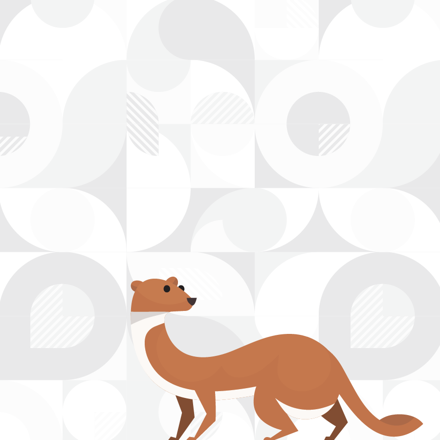

# Coming soon ...

Cada grup haurà de enfrentar-se a un escenari de ciència de dades diferent —tots a partir de les mateixes dades de **eficiència energètica**—. Aquests escenaris estaràn disponible divendres. Estigueu atents als nostres canals de comunicació oficials per no perdre-us cap novetat ni instrucció addicional.

A aquesta pàgina penjarem les presentacions en *Google Slides*.

  
  
  
  

